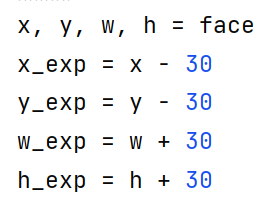

# 识别人脸制作证件照
### 我的思路：
- [x] 1.首先根据人像图片检测出人脸
- [x] 2.根据得到的人脸图片去除背景（抠出人脸透明图片）
- [x] 3.生成人脸透明图片相同大小的某种颜色的背景图片
- [x] 4.将透明图片与背景图片结合生成证件照初始图片
- [x] 5.将生成的证件照初始图片整合成一寸/两寸的打印模版

### 代码操作流程
在img_matting.py中你需要更换你在[https://www.remove.bg]上申请到的API key
在get_ori.py里面输入你想要得到证件照的图片
在generate_id_photo.py中可以选择生成1寸/2寸的照片模版

 
这里的30需要根据图片灵活更改
